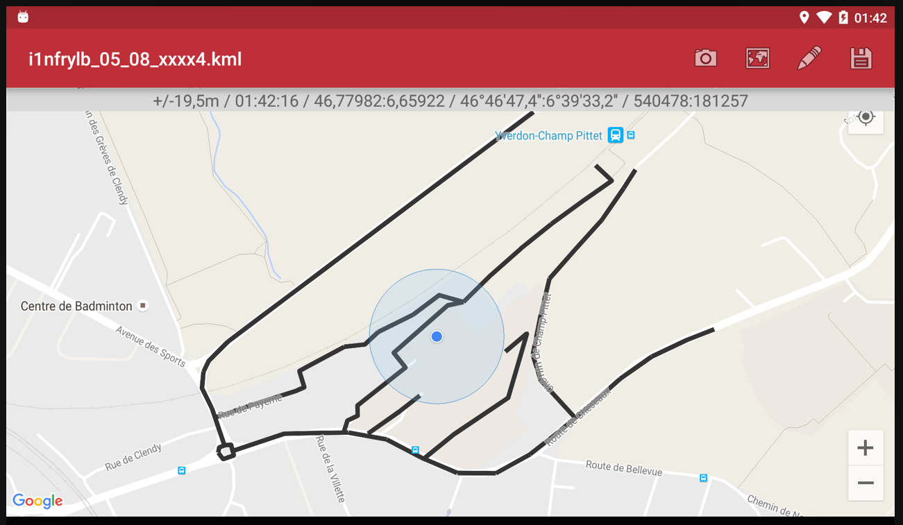
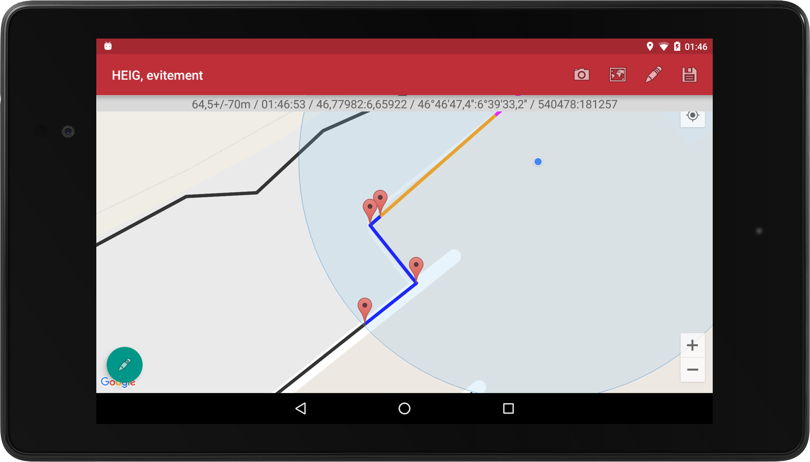
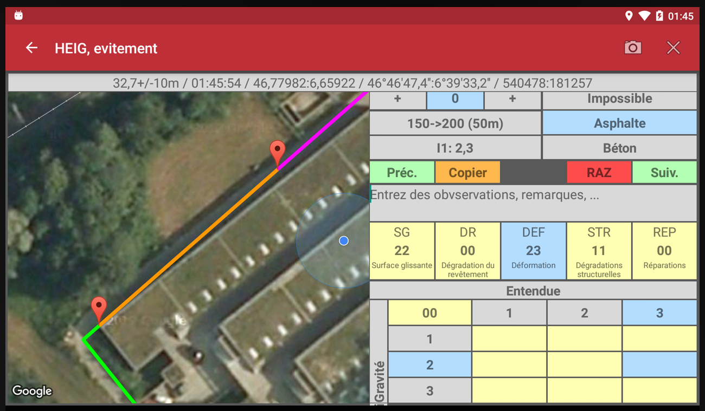
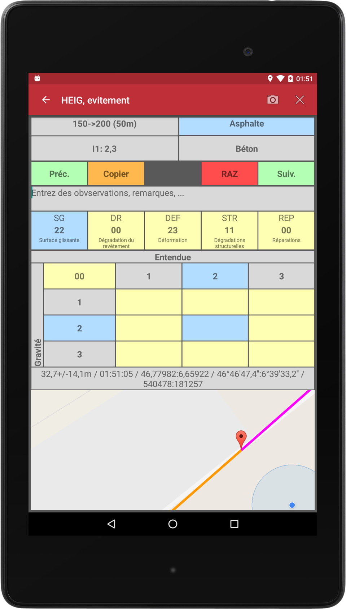
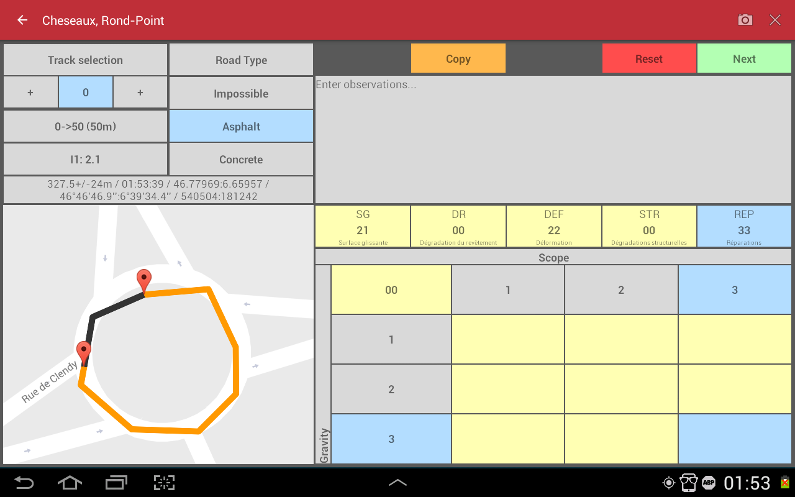
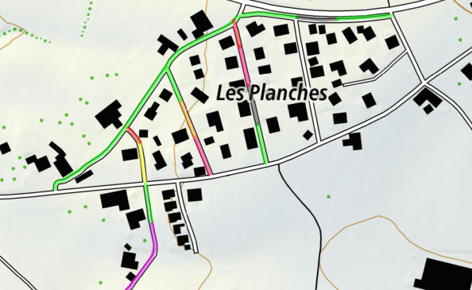
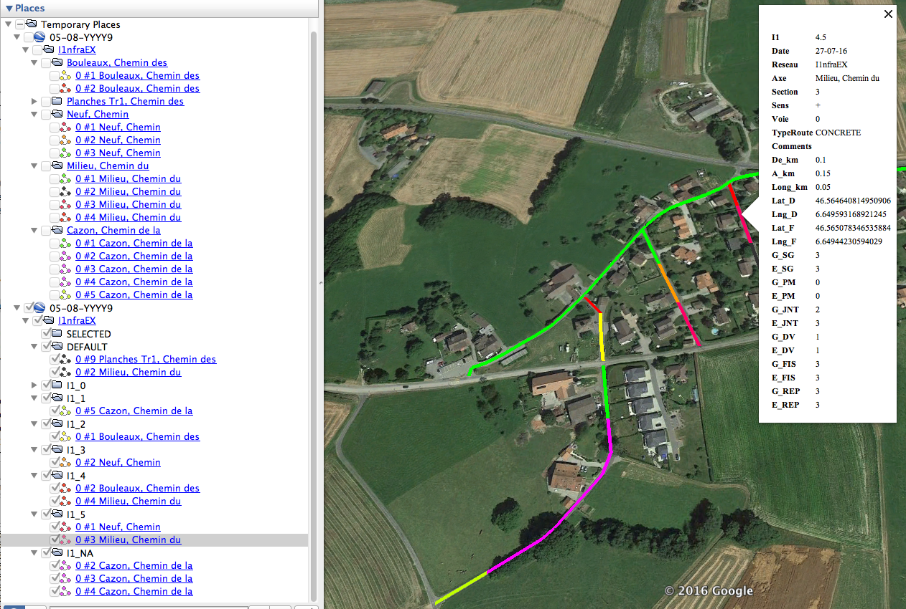

# I1nfralab Android Application

***Public version intended for presentation, without any copyrighted materail, source code, documentation nor software release.***

***Version publique de présentation, sans contenu protégé, sans code source, sans documentation ni logiciel exécutable.***

*French version & Illustrations below. PDF poster available.*

## Public Abstract

### Development of a software to evaluate road state

**I1nfralab is a civil engineering business-oriented Android application. It is conceived to allow technicians to define the pavement condition of a road or of a road network. The product was mandated and is used by [Infralab Inc.](http://www.infralab.ch/)**

### Goal of the software (Fig 2,3)

The software allows a technician to define the pavement condition by defining the severity and extent of each distress. The state of the road section is then expressed in terms of the I1-index, which is based on the swiss standard (VSS SN640925B, 2003). 

### Functionalities (Fig. 3,4,5)

For each section and lane, the operator will have to define the type of road, the distresses together with their extent and severity. After that, the I1-index is calculated for the selected section, in accordance with the Swiss standards. On a map, the pavement condition of a road network, a road, a section or a lane is then displayed.

### Exportation formats (Fig. 6,7)

Collected raw data is stored in a specific data model that fits the needs of the user, but data can be exported to KML format as well, **in order to be visualised in an existing Geographic Information System, like Google Earth.**

### Details

*The application was developed in 2016 as a Diploma Work by Valentin Minder (Author), at the University of Applied Sciences Western Switzerland (HEIG-VD/HES-SO). The product is copyrighted to Infralab and licensed to the Author and University for non-commercial use only.*

## Résumé public

### Développement d'un logiciel pour relever l'état d'une route

**I1nfralab est une application Android orientée métier d'Ingénierie civile. Elle est conçue pour aider les techniciens à évaluer l'état des chaussées pour l’ensemble ou une partie d’un réseau routier. Le produit a été mandaté et est utilisé par la société [Infralab SA](http://www.infralab.ch/).**

### But du logiciel (Fig. 1,2)

Le logiciel permet à un opérateur d’évaluer l'état des voies de circulation en relevant les dégradations de la chaussée observées sur le terrain. L'état d'une chaussée est exprimé en terme d'indice d'état I1, selon les normes en vigueur en Suisse (VSS SN640925B, 2003). 

### Fonctionalités (Fig. 3,4,5)

Pour chaque section et voie, sont saisis le type de route, les types et niveaux de dégradations, avec gravité et étendue. L'indice d'état I1 est ensuite calculé pour la section sélectionnée. L'application donne ensuite un aperçu de l’état du réseau routier, des axes, des sections/tronçons et des voies de circulation au moyen d’une carte intégrée dans l’application.

### Formats d'exportation (Fig. 6,7)

Les données brutes récoltées sont stockées dans un modèle de données approprié, et également exportées au format KML, permettant leur **visualisation aisée dans un Système d'Information Géographique existant, tel que Google Earth.**

### Détails

*L'application a été développée en 2016 par Valentin Minder (Auteur) dans le cadre d'un Travail de Diplôme à la Haute Ecole d'Ingénierie (HEIG-VD/HES-SO, "Université"). Le produit complet est sous copyright d'Infralab SA, avec une licence pour l'Auteur et l'Université pour un usage non-commercial uniquement.*

## Illustrations

Fig.1 Network View (general)

Fig.2 Network View (zoomed)

Fig.3 Input of data on phone (landscape)

Fig.4 Input of data on phone (portrait)

Fig.5 Input of data on tablet

Fig.6 Output visualisation on GeoPortal Maps Admin

Fig.7 Output visualisation on GoogleEarth

